<div align="center">
  
</div>

---

<div align="center">

### 🛠 Tech Stack


</div>

---

<div align="center">

### 📡 Currently Deploying

```
┌─────────────────────────────────────────────────────────┐
│  ☸  Kubernetes CKA              ████████████░░░░  75%   │
│  🌍  Terraform Advanced          ██████████░░░░░░  65%   │
│  🔄  GitOps (ArgoCD/Flux)        ████████░░░░░░░░  55%   │
│  ☁️  Multi-cloud Architecture    ███████░░░░░░░░░  50%   │
└─────────────────────────────────────────────────────────┘
```

</div>

---

<div align="center">

### 📊 GitHub Stats


&nbsp;&nbsp;


</div>

---

<div align="center">

### 🤝 Connect

[](https://linkedin.com/in/zariframzan)
[](mailto:zarif@example.com)
[](https://github.com/zariframzan)

<br/>


<br/>

*"The goal of automation is to free humans to do the things that are truly human."*

</div>
