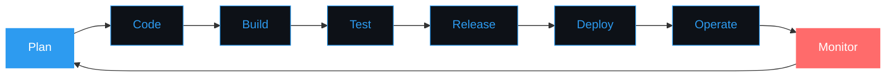

<div align="center">

<!-- Animated Header -->


<!-- Typing Animation -->


</div>

---

<div align="center">

### 👨‍💻 About Me

</div>

```yaml
apiVersion: v1
kind: DevOpsEngineer
metadata:
  name: Zarif Ramzan
  namespace: production
spec:
  role: DevOps Engineer
  location: Kuala Lumpur, Malaysia 🇲🇾
  focus:
    - Infrastructure Automation
    - CI/CD Pipeline Design
    - Cloud Architecture
    - Container Orchestration
  motto: "Automate everything, deploy anywhere, fail fast, recover faster"
  status: 
    learning: Kubernetes CKA | Terraform Advanced | GitOps
    building: Scalable cloud infrastructure
    passion: Bridging Dev and Ops seamlessly
```

---

<div align="center">

## 🛠️ DevOps Toolkit

### ☁️ Cloud Platforms


### 🐳 Containers & Orchestration


### 🏗️ Infrastructure as Code


### 🔄 CI/CD & Automation


### 📊 Monitoring & Observability


### 💻 Scripting & Programming


### 🗄️ Databases & Caching


### 🔧 Version Control & Tools


</div>

---

<div align="center">

## 📊 GitHub Statistics


<br/>


<br/>


</div>

---

<div align="center">

## 🎯 Current Focus

</div>

<table>
<tr>
<td width="50%">

### 🚀 Active Projects
- ⚡ **Cloud Migration** - Kubernetes cluster setup
- 🔧 **Terraform Modules** - Reusable IaC components
- 📦 **CI/CD Pipelines** - GitLab + ArgoCD
- 🔐 **Security Automation** - DevSecOps practices

</td>
<td width="50%">

### 📚 Learning Journey
- **Kubernetes CKA** - Certification path
- **Terraform Advanced** - Complex modules
- **GitOps with ArgoCD** - Declarative deployments
- **Service Mesh** - Istio & Linkerd

</td>
</tr>
</table>

---

<div align="center">

## 💡 DevOps Philosophy

</div>



---

<div align="center">

## 📈 Contribution Activity


</div>

---

<div align="center">

## 🌟 Featured Projects

</div>

<div align="center">

[](https://github.com/ZarifRamzan/unix_pkg_setup)

</div>

---

<div align="center">

## 🎓 Certifications & Learning

| 🏆 Certification | 📅 Status | 🔗 Verify |
|:-----------------|:----------|:----------|
| AWS Solutions Architect | 🎯 In Progress | - |
| Kubernetes CKA | 📖 Learning | - |
| Terraform Associate | 🎯 Planned | - |
| Linux Foundation | ✅ Familiar | - |

</div>

---

<div align="center">

## 🌐 Connect With Me

<a href="https://linkedin.com/in/zarif-ramzan">
  
</a>
<a href="https://twitter.com/ZarifRamzan">
  
</a>
<a href="mailto:zarif@example.com">
  
</a>
<a href="https://zarif.dev">
  
</a>

</div>

---

<div align="center">

## 💭 DevOps Quote of the Day


</div>

---

<div align="center">

### 👁️ Profile Views


</div>

---

<div align="center">

### 🐍 Contribution Snake

<picture>
  <source media="(prefers-color-scheme: dark)" srcset="https://raw.githubusercontent.com/ZarifRamzan/ZarifRamzan/output/github-contribution-grid-snake-dark.svg">
  <source media="(prefers-color-scheme: light)" srcset="https://raw.githubusercontent.com/ZarifRamzan/ZarifRamzan/output/github-contribution-grid-snake.svg">
  
</picture>

</div>

---

<div align="center">
  
**"Infrastructure as Code is not just about automation; it's about treating infrastructure with the same rigor as application code."**


</div>